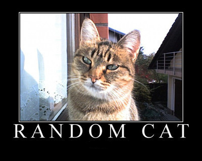

<!SLIDE>
# Regular text

* Standard markdown image tags are recognized
    * Image paths begin from the slide's current directory.
    * Use relative paths to access other directories.
* Videos and other non-image files should be accessed via a `file/` prefix.
    * These paths should be relative to the root of your presentation.
    * Example: `<source src="file/video.mp4" type="video/mp4">`
        * Loads video at `<presentation>/video.mp4`

<!SLIDE>
# A video

<video width="950" height="535" controls>
  <source src="http://html5demos.com/assets/dizzy.mp4" type="video/mp4">
  Your browser does not support the video tag.
</video>

~~~SECTION:notes~~~
If this were saved locally, the tag would look like:

    <video width="950" height="535" controls>
      <source src="file/video.mp4" type="video/mp4">
      Your browser does not support the video tag.
    </video>

~~~ENDSECTION~~~

<!SLIDE autoplay>
## An autoplay video

<video width="950" height="535">
  <source src="http://html5demos.com/assets/dizzy.mp4" type="video/mp4">
  Your browser does not support the video tag.
</video>

~~~SECTION:notes~~~
If this were saved locally, the tag would look like:

    <video width="950" height="535">
      <source src="file/video.mp4" type="video/mp4">
      Your browser does not support the video tag.
    </video>

~~~ENDSECTION~~~

<!SLIDE>
# A picture

